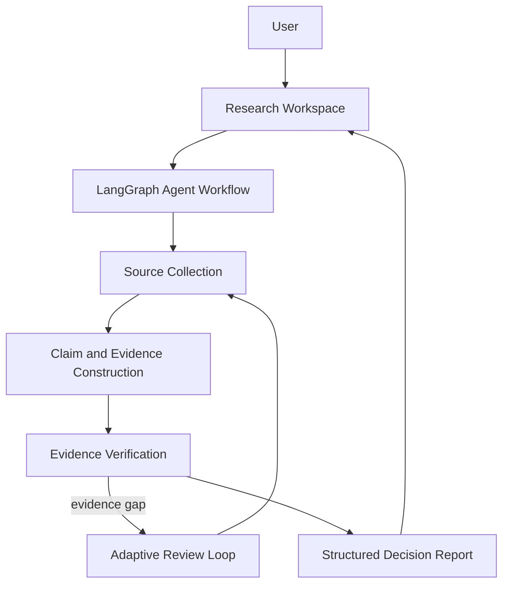

# EvidenceGraph

**AI-native competitive intelligence research workspace powered by a multi-agent workflow and evidence-grounded analysis.**

EvidenceGraph 把“搜索—判断—补证—报告”组织成一个面向研究者的产品流程。用户只需定义目标产品、竞品和研究目标；系统负责多源采集、Claim / Evidence 构建、Critic 复核、Review Ticket 定向补证，并交付可追溯的结构化决策报告。


## Demo

- [Live Demo — EvidenceGraph Workspace](https://competitor-analysis-agent-system-two.vercel.app/)
- [Sample Report — product capability showcase](https://competitor-analysis-agent-system-two.vercel.app/reports/demo)

线上入口包含两种清晰的数据边界：

- **Demo mode**：`/reports/demo` 使用明确标记的展示样例，用于快速理解报告体验，不代表后端运行结果。
- **Backend mode**：Overview、New Research、Running、Report、Evidence 与 Audit 只渲染真实 API 数据；字段缺失时显示 unavailable，不生成替代结论。

真实 Provider 分析需要在本地或私有部署中配置凭据。密钥只保存在服务端环境中。

## Overview

普通 Agent dashboard 关注节点是否运行；EvidenceGraph 关注研究结论是否值得相信。

产品界面不会向普通用户暴露 node、tool call、provider log 或 token，而是将工作流翻译为五个研究阶段：规划研究、采集来源、构建证据、验证洞察、生成报告。底层仍保留完整 trace 与 run manifest，供审计和工程排查使用。

## Features

### 1. Research Planning

将目标产品、竞品、研究目标、证据策略和受众映射到既有 TaskConfig；支持竞品推荐与研究目标润色，不静默覆盖用户输入。

### 2. Multi-agent Research Workflow

LangGraph 协调 Planning、Research、Evidence Extraction、Analysis、Critic、Review 与 Writer。前端通过 SSE 展示面向用户的实时进度，而不是底层图执行细节。

### 3. Evidence-aware Verification

Claim 必须绑定 Evidence 与 Source。缺少支撑、存在冲突或已经过期的结论会被阻断、降级或排除，Report 不把未知信息包装成确定事实。

### 4. Adaptive Review Loop

Critic 生成 Review Ticket，系统按照缺口定向回到 Research、Interaction、Analyst 或 Reviewer 路径。用户可在 Audit 中补证、解决、降级或标记不可获得。

### 5. Decision-oriented Reports

真实 workflow 输出结构化 Report：Executive Summary、Decision Highlights、Comparison Matrix、Key Insights、Strategic Opportunities、Evidence Coverage 与 Limitations。每个生成项保留 Claim / Evidence 引用。

## Architecture



```text
React Workspace
    ↓ existing API client + view-model adapters
FastAPI API
    ↓
LangGraph workflow
    ↓
Search / LLM / optional XHS providers
    ↓
SQLite task, evidence, review and report persistence
```

## Frontend Design

新版前端从 developer console 收口为 **Editorial Evidence Workspace**：

- Overview 只呈现真实任务、可计算指标与 review attention。
- New Research 使用渐进式三步表单，复杂配置折叠到 Advanced options。
- Running 将 SSE 事件映射为研究阶段、活动与业务指标。
- Report 将结构化输出分为 Report、Evidence、Audit 三层。
- Sample Report 是唯一允许 showcase data 的路由，并有醒目的 Demo 标识。

## Tech Stack

| Layer | Technology |
| --- | --- |
| Frontend | React 19, Vite |
| Backend | FastAPI, Pydantic v2, SQLite |
| Agent runtime | LangGraph StateGraph |
| Communication | REST + Server-Sent Events |
| Providers | AnySearch / DuckDuckGo, DeepSeek, optional XHS HTTP MCP |
| Verification | pytest, Playwright, Vite production build |

## Quick Start

推荐使用 Python 3.12，并严格安装仓库锁定依赖。

```bash
python3.12 -m venv .venv
source .venv/bin/activate
python -m pip install -r requirements-dev.txt
```

启动后端：

```bash
cd backend
uvicorn app.main:app --reload --port 8000
```

启动前端：

```bash
cd frontend
npm install
npm run dev
```

打开 `http://localhost:5173/`。API 文档位于 `http://localhost:8000/docs`。

Windows PowerShell 激活命令为 `.venv\Scripts\Activate.ps1`。完整运行时与可选 XHS 环境说明见 [docs/runtime-setup.md](docs/runtime-setup.md)。

## Provider Configuration

复制 `.env.example` 并按需配置：

```env
DATABASE_URL=sqlite:///./data/app.db
PUBLIC_DEMO_MODE=false

SEARCH_PROVIDER=anysearch
ANYSEARCH_API_KEY=your_anysearch_key

LLM_PROVIDER=deepseek
DEEPSEEK_API_KEY=your_deepseek_key
DEEPSEEK_BASE_URL=https://api.deepseek.com/chat/completions
DEEPSEEK_MODEL=deepseek-chat

ALLOW_PROVIDER_FALLBACK=false
ALLOW_EMPTY_SEARCH_FALLBACK=false
```

无凭据模式可用于本地流程和 CI 验证，但其 fixture / mock 结果不能作为真实市场研究结论。

## Project Structure

```text
competitor-analysis-agent-system/
├── api/                         # Vercel Python entry
├── backend/
│   ├── app/
│   │   ├── api/                 # FastAPI routes
│   │   ├── core/                # LangGraph nodes, routing and runtime
│   │   ├── models/              # Task, Evidence, Review and Report schemas
│   │   ├── providers/           # Search, LLM and XHS adapters
│   │   ├── skills/              # Prompt skill registry
│   │   └── storage/             # SQLite persistence
│   └── tests/
├── frontend/
│   ├── public/illustrations/    # Approved product illustrations
│   └── src/
│       ├── api/                 # Single API client and SSE boundary
│       └── new/
│           ├── adapters/        # Backend → view-model mapping
│           ├── components/      # Shared workspace primitives
│           ├── features/        # Research, report and audit UI
│           ├── pages/           # Product routes
│           └── styles/          # Design tokens and composition
├── docs/
├── examples/
├── scripts/
└── vercel.json
```

## Verification

```bash
cd backend
python -m pytest -q
```

```bash
cd frontend
npm run build
```

可选的真实 Provider 与 XHS smoke test 需要对应凭据、网络和登录状态：

```bash
python scripts/smoke_live_providers.py --require-live
python scripts/smoke_xhs_mcp.py --autostart --require-login --require-search
```

## Limitations

- 真实研究质量依赖搜索与 LLM Provider 的可用性、覆盖面和速率限制。
- 社交平台来源受登录、区域、平台策略和内容可访问性影响，不保证持续可用。
- 线上 Demo 适合展示产品与静态 Sample Report；未配置私有凭据时不代表生产级 live research 环境。
- SSE 不提供服务端历史事件重放；刷新 Running 页面后会查询任务状态并继续跟踪，但不会重复启动 workflow。
- 自动生成内容仍应结合 Evidence、Review Ticket 与 Limitations 进行人工复核后用于重要决策。

## License

[MIT](LICENSE)
