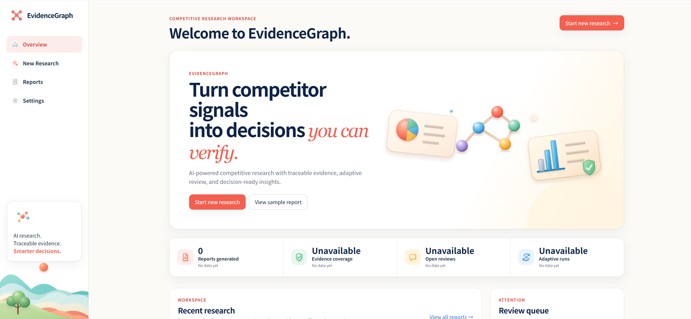
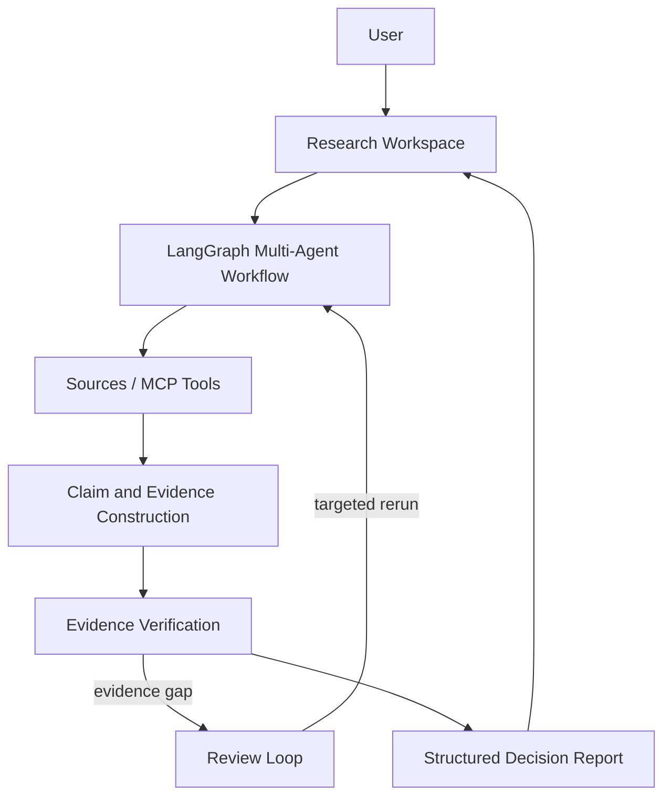

# EvidenceGraph

**由多智能体工作流、证据验证与自适应复核驱动的 AI 竞品情报研究工作台。**

EvidenceGraph 把“搜索—判断—补证—报告”组织成一个面向研究者的产品流程。用户只需定义目标产品、竞品和研究目标；系统负责多源采集、Claim / Evidence 构建、Critic 复核、Review Ticket 定向补证，并交付可追溯的结构化决策报告。


🚀 [Live Demo](https://competitor-analysis-agent-system-two.vercel.app/) · 📖 [Sample Report](https://competitor-analysis-agent-system-two.vercel.app/reports/demo)



真实 Provider 分析需要在本地或私有部署中配置凭据。密钥只保存在服务端环境中。

## Summary

| Capability | Description |
| --- | --- |
| 🔍 Multi-Agent Research | 使用 LangGraph shared state 协调规划、检索、证据抽取、分析、复核与报告生成。 |
| 🛡️ Evidence Verification | 保留 Claim—Evidence—Source 关系，并阻断、降级或排除缺少支撑的结论。 |
| 🔄 Adaptive Review Loop | Critic 生成 Review Ticket，再按证据缺口定向分派补采或复核任务。 |
| 🧩 Skill Layer | 支持导入 `SKILL.md`，把研究方法与产品分析框架注入对应 Prompt slot。 |
| 📊 Structured Reports | 输出 Comparison Matrix、决策洞察、证据覆盖、Limitations 以及 Evidence / Audit 视图。 |
| 🖥️ Product Workspace | 提供 Overview、New Research、Running、Report、Evidence 与 Audit 的完整产品路径。 |

## Overview

普通 Agent dashboard 关注节点是否运行；EvidenceGraph 关注研究结论是否值得相信。

产品界面不会向普通用户暴露 node、tool call、provider log 或 token，而是将工作流翻译为五个研究阶段：规划研究、采集来源、构建证据、验证洞察、生成报告。底层仍保留完整 trace 与 run manifest，供审计和工程排查使用。

## Architecture

下面是用户视角的研究闭环，不代表系统只是线性 pipeline：LangGraph 内部维护 shared state，并通过 conditional routing、Review Ticket 优先级和目标节点动态选择后续执行路径。



```text
React Workspace
    ↓ existing API client + view-model adapters
FastAPI API
    ↓
LangGraph workflow
    ↓
Search / LLM / optional XHS providers
    ↓
SQLite task, evidence, review and report persistence
```

## Features

### 🔍 Multi-Agent Research Workflow

- 使用 LangGraph `StateGraph` 在 Planner、Research、Evidence、Analyst、Critic、Reviewer 与 Writer 之间共享结构化状态。
- 通过 conditional edges 决定继续复核、停止循环或进入报告生成，不依赖固定的单向执行链。
- Review Ticket 的 `target_node` 驱动 Research、Interaction、Analyst 或 Reviewer 的动态任务分派。
- 前端通过 SSE 将执行过程翻译为研究阶段、活动与指标，不向普通用户展示底层 graph internals。

### 🛡️ Evidence-aware Verification

- Claim 记录 Supporting Evidence，Evidence 继续关联 Source，形成可检查的证据链。
- Unsupported、uncertain、contradicted、stale 或 downgraded 结论不会被包装成确定事实。
- 结构化 Report 生成项保留 `claim_ids` 与 `evidence_ids`，前端只渲染已有字段。

### 🔄 Adaptive Review Loop

- Critic 检查证据缺口、冲突与高风险推断，并生成 Review Ticket。
- Review Ticket 保存目标节点、缺失证据类型、严重程度、重跑次数和受影响产物。
- targeted rerun 只回到与当前缺口相关的路径；达到循环或重跑上限后保持明确的未解决状态。
- 用户可以在 Audit 中补证、解决、忽略、降级或标记证据不可获得。

### 🧩 Skill Layer

- 支持从 GitHub 导入 `SKILL.md`，并保存 Skill catalog 与 assignment。
- `SkillPromptComposer` 按 competitor analysis、pricing、persona、SWOT 等 slot 选择研究方法。
- Skill 内容用于 Prompt methodology injection，不替代 Evidence gate，也不直接制造报告事实。

### 📊 Structured Decision Reports

- 真实 workflow 输出 Executive Summary、Decision Highlights、Comparison Matrix、Key Insights、Strategic Opportunities、Evidence Coverage 与 Limitations。
- 同时保留 Feature Tree、Pricing Model、User Persona、SWOT 与 Markdown sections，供完整研究交付和审计使用。
- Report、Evidence、Audit 三个视图分别承载决策阅读、证据检查与人工复核。

## Product Experience

新版前端从 developer console 转向 **report-centric research workspace**。用户围绕研究任务与报告推进工作，底层 Agent node、provider log、tool call 和 token 信息不会占据主要产品界面。

- Overview 只呈现真实任务、可计算指标与 review attention。
- New Research 使用渐进式三步表单，将目标产品、竞品、研究目标、证据策略和受众映射到 TaskConfig；竞品推荐与目标润色不会静默覆盖用户输入。
- Running 将 SSE 事件映射为研究阶段、活动与业务指标。
- Report 将结构化输出分为 Report、Evidence、Audit 三层，支持 report-centric 阅读、Evidence inspection 与 human review。
- Sample Report 是唯一允许 showcase data 的路由，并有醒目的 Demo 标识。

## Tech Stack

| Layer | Technology |
| --- | --- |
| Frontend | React 19, Vite |
| Backend | FastAPI, Pydantic v2, SQLite |
| Agent runtime | LangGraph StateGraph |
| Communication | REST + Server-Sent Events |
| Providers | AnySearch / DuckDuckGo, DeepSeek, optional XHS HTTP MCP |
| Verification | pytest, Playwright, Vite production build |

## Quick Start

推荐使用 Python 3.12，并严格安装仓库锁定依赖。

```bash
python3.12 -m venv .venv
source .venv/bin/activate
python -m pip install -r requirements-dev.txt
```

启动后端：

```bash
cd backend
uvicorn app.main:app --reload --port 8000
```

启动前端：

```bash
cd frontend
npm install
npm run dev
```

打开 `http://localhost:5173/`。API 文档位于 `http://localhost:8000/docs`。

Windows PowerShell 激活命令为 `.venv\Scripts\Activate.ps1`。完整运行时与可选 XHS 环境说明见 [docs/runtime-setup.md](docs/runtime-setup.md)。

## Provider Configuration

复制 `.env.example` 并按需配置：

```env
DATABASE_URL=sqlite:///./data/app.db
PUBLIC_DEMO_MODE=false

SEARCH_PROVIDER=anysearch
ANYSEARCH_API_KEY=your_anysearch_key

LLM_PROVIDER=deepseek
DEEPSEEK_API_KEY=your_deepseek_key
DEEPSEEK_BASE_URL=https://api.deepseek.com/chat/completions
DEEPSEEK_MODEL=deepseek-chat

ALLOW_PROVIDER_FALLBACK=false
ALLOW_EMPTY_SEARCH_FALLBACK=false
```

无凭据模式可用于本地流程和 CI 验证，但其 fixture / mock 结果不能作为真实市场研究结论。

## Project Structure

```text
competitor-analysis-agent-system/
├── api/                         # Vercel Python entry
├── backend/
│   ├── app/
│   │   ├── api/                 # FastAPI routes
│   │   ├── core/                # LangGraph nodes, routing and runtime
│   │   ├── models/              # Task, Evidence, Review and Report schemas
│   │   ├── providers/           # Search, LLM and XHS adapters
│   │   ├── skills/              # Prompt skill registry
│   │   └── storage/             # SQLite persistence
│   └── tests/
├── frontend/
│   ├── public/illustrations/    # Approved product illustrations
│   └── src/
│       ├── api/                 # Single API client and SSE boundary
│       └── new/
│           ├── adapters/        # Backend → view-model mapping
│           ├── components/      # Shared workspace primitives
│           ├── features/        # Research, report and audit UI
│           ├── pages/           # Product routes
│           └── styles/          # Design tokens and composition
├── docs/
├── examples/
├── scripts/
└── vercel.json
```

## Verification

```bash
cd backend
python -m pytest -q
```

```bash
cd frontend
npm run build
```

可选的真实 Provider 与 XHS smoke test 需要对应凭据、网络和登录状态：

```bash
python scripts/smoke_live_providers.py --require-live
python scripts/smoke_xhs_mcp.py --autostart --require-login --require-search
```

## License

[MIT](LICENSE)
